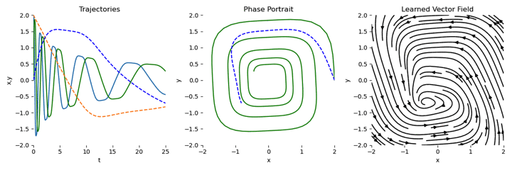
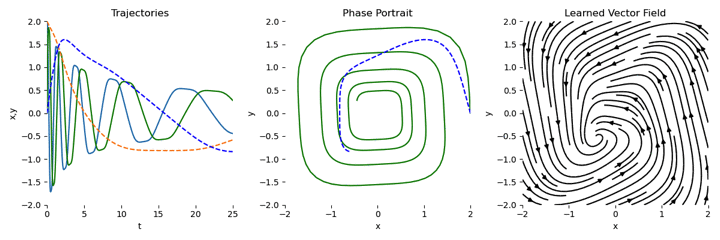

# PaddleXDE
PaddleXDE is a libarary that helps you build deep learning applications for PaddlePaddle using ordinary differential equations.

## Installation

To install latest on GitHub:
```bash
pip install git+https://github.com/DrownFish19/paddlexde.git
```


## Examples

Examples are placed in the `example` directory.

### ODE DEMO


### ODE Adjoint DEMO


## Requirements

```text
paddle
```

## Acknowledgments

* [torchdiffeq](https://github.com/rtqichen/torchdiffeq.git)
* [torchsde](https://github.com/google-research/torchsde.git)
* [torchcde](https://github.com/patrick-kidger/torchcde.git)
* [DifferentialEquations.jl](https://github.com/SciML/DifferentialEquations.jl.git)
